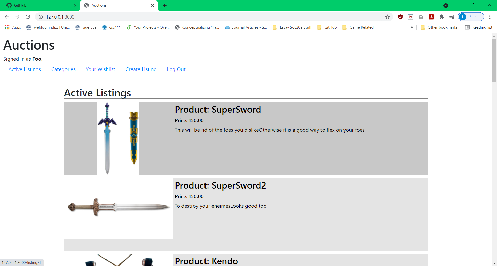
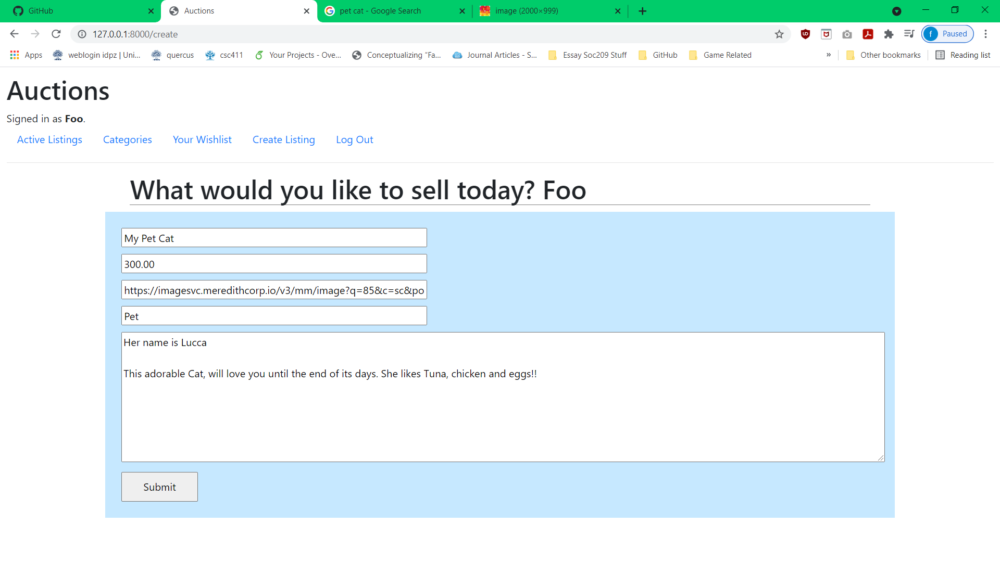
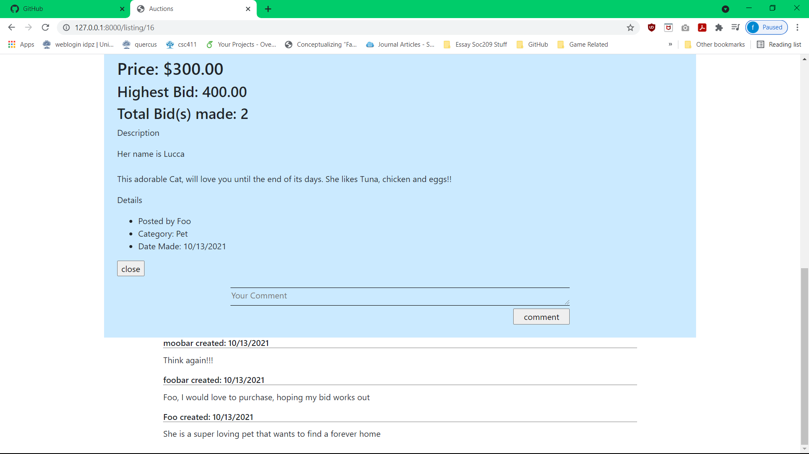
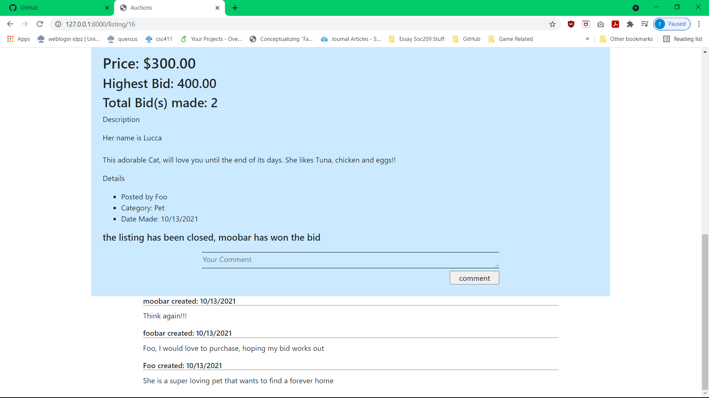
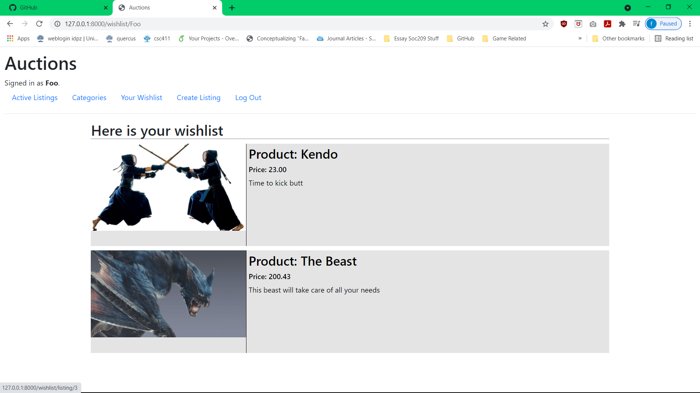
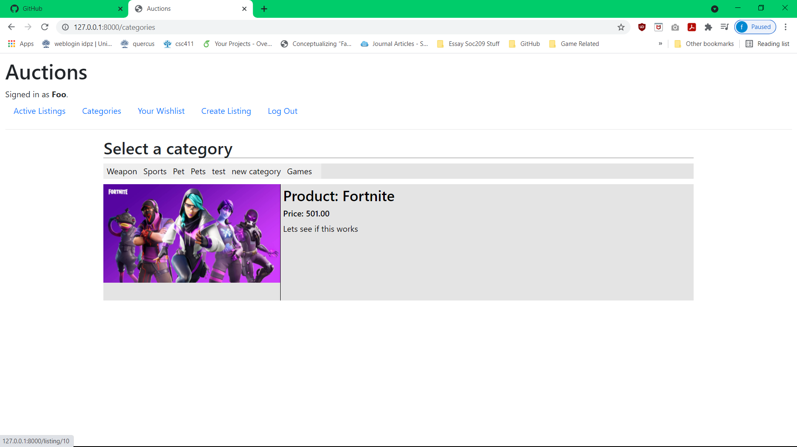

# Auction House

## Description
The app is an auction house where users can signup to place bids on products or to create product pages for people to bid on. Product pages contain information such as product's description initial bid, image of the product, name, as well as who posted it. When bidding it will show what the highest bid is as well as the number of bids that the product has. Other quality of life functions are being able to sort by category, comment on posts and being able to wishlist products.

## Challenges
- First time learning and creating a relational database diagram. This was needed in order to make sense of the different relationship between the tables.
- Submitting the correct components of a form to be stored in the back end.

## Improvements
- Would be adding a chat system so that users could talk to each other instead of through comments.
- Category selection GUI update. So that we can have a drop menu when selecting a category instead of a line of buttons
- Possibly standardization of product image size when viewing the actual product, as it currently stand it will display the full image size. This can be unwieldy with larger image files

## Screenshots

- All for products are currently stored as links to an online source intead of a image file. 
   

- Just a brief view of the bidding system currently in place.
   

- This page will only show things that have been wishlisted, they also can be removed from said wishlist. 
   

- Although this page is functioning fine, I do belive from a GUI aspect could use some work.
- One thing that could have beend one was to create a set list of static categories. Where the user could choose from when creating a listing.

## Credit
This project was created following content from the Havard cs50 Web Dev course. Here is a [link](https://www.youtube.com/watch?v=zFZrkCIc2Oc&t=0s) to be the first lecture where you can find more information of about the course.
